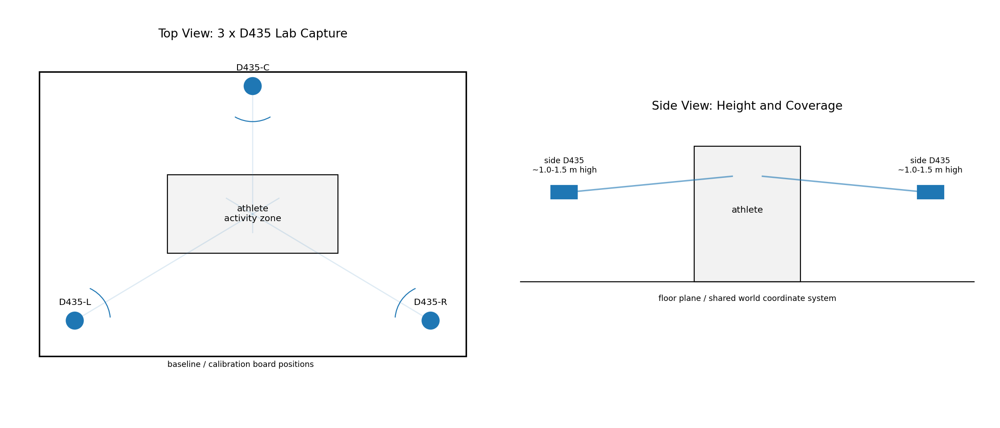
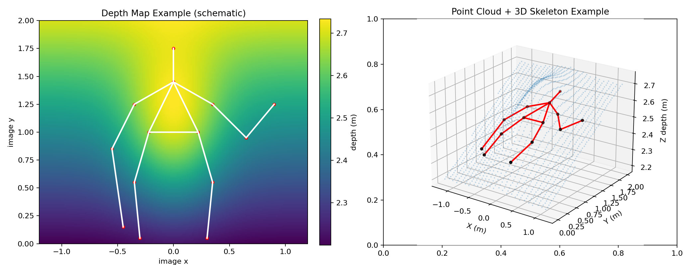

# Task 3: Intel RealSense D435 Lab Capture vs Phone Video CV

Scope: evaluate a 3-camera Intel RealSense D435 laboratory setup for baseball motion analysis and compare it with single-phone video plus CV/pose estimation.

Important device note: `D435` provides RGB, stereo infrared/depth, and point-cloud data through the RealSense SDK. It does not include an IMU; that is the `D435i` variant.

## 1. Three-D435 Lab Capture Plan

### Hardware Deployment

D435 hardware summary for planning:

| item | practical meaning for this project |
|---|---|
| Active infrared stereo depth | provides metric depth and point cloud, but multiple cameras can interfere through projected IR patterns |
| Global-shutter stereo imagers | better for fast motion than rolling-shutter stereo, but exposure and frame rate still matter |
| Depth / IR / RGB streams | body pose can use RGB, depth can map 2D joints into 3D, and IR/depth can help segmentation |
| No IMU on D435 | acceleration/gyro are unavailable unless using D435i; do not claim IMU-based motion metrics from D435 |
| USB host bandwidth | three cameras need careful stream-resolution selection and USB-controller planning |

- Use three fixed cameras around the athlete: left-front/side, center/front or back, and right-front/side. The exact angles should be tuned to the batting or pitching direction.
- Keep all cameras on rigid mounts. Put the athlete action zone inside the overlapping depth field of view, not merely the RGB field of view.
- Start with camera height around the athlete's torso level, then adjust to keep hands, bat, stride foot, and release/contact region inside the common volume.
- Use a calibration board or AprilTag/Charuco board at multiple positions across the activity volume for extrinsic calibration.

### Synchronization and Calibration

- Preferred synchronization: hardware sync wiring across the D400 cameras, with one master and two slaves, then validate frame timestamps in software.
- Fallback synchronization: software timestamp alignment. This is easier but less safe for high-speed baseball motions because one-frame timing error changes speed and release/contact metrics.
- Intrinsics: use factory intrinsics from RealSense SDK as a starting point, then verify RGB-depth alignment and depth scale.
- Extrinsics: estimate each camera pose in a shared lab coordinate system using a calibration target. Transform depth points and 3D joints into that shared coordinate system.
- Multi-camera depth: RealSense depth uses active infrared stereo; overlapping projectors can interfere. In practice, test emitter on/off, emitter power, camera angles, and temporal staggering if depth noise appears.

### Best Deployment Guidelines

- Use an indoor controlled-light lab; avoid direct sunlight and reflective/transparent surfaces.
- Leave overlap between all cameras but avoid placing cameras so close that one camera's IR pattern saturates another.
- Mark the athlete action zone on the floor and keep the calibration board coverage larger than that zone.
- Capture a short calibration/quality clip before each session: static athlete pose, slow arm swing, and a known-distance object.
- For bat/ball metrics, D435 is not enough by itself: you still need robust object detection/segmentation and may need higher-speed cameras for ball-contact timing.

## 2. Data Outputs and Metric Extraction

D435 raw outputs and derived data:

| data type | available from D435? | use in pose/baseball analysis | limitation |
|---|---|---|---|
| RGB image | yes | 2D pose, bat/ball detection, visual QA | motion blur and lighting still matter |
| Stereo infrared images | yes | depth computation, low-texture support | IR interference across cameras can reduce quality |
| Depth map | yes | metric 3D position, subject segmentation, occlusion reasoning | holes/noise on reflective, distant, or fast-moving regions |
| Point cloud | yes, derived from depth | 3D skeleton fitting, body/bat spatial reconstruction | needs extrinsic calibration for multi-view fusion |
| IMU | no for D435 | unavailable unless using D435i | do not assume acceleration/gyro data from D435 |
| 3D joints | derived, not native | OpenPose/RTMPose + depth lifting, RGB-D pose models, SMPL fitting | joint quality depends on pose model and depth association |

### SlyMask Metrics Alignment

| metric | context | 3 x D435 capability | phone CV capability | note |
|---|---|---|---|---|
| Estimated Bat Speed | batting | possible if bat is reconstructed/tracked in 3D; otherwise RGB/object proxy | 2D proxy only without calibration | D435 can recover metric scale only when bat endpoints are segmented/tracked in calibrated 3D. |
| Swing Speed | batting | 3D bat endpoint speed or wrist/hand speed proxy | 2D pixel/normalized proxy | D435 is better for physical speed; phone needs scale/camera calibration. |
| Hip Rotation | batting | reliable 3D pelvis yaw range | view-dependent 2D/monocular 3D proxy | D435 reduces perspective ambiguity. |
| Hip-Shoulder Sep | both | reliable 3D hip/shoulder yaw difference | usable but orientation drift/view dependent | Clear geometry for both, stronger with depth. |
| Weight Transfer | both | pelvis/COM trajectory proxy; better if fused with force plate | not reliable from monocular video | D435 gives metric 3D displacement but not true force transfer. |
| Lead Knee Angle | both | reliable 3D anatomical angle | usable when view is favorable; poor with side occlusion | Depth resolves side/front projection ambiguity. |
| Trunk Tilt / Lean | both | reliable 3D torso-vs-vertical angle | usable but camera-pitch dependent | Needs gravity/vertical definition in both systems. |
| Contact Time | batting | not reliable unless ball and bat contact are visible/tracked at high fps | not reliable | D435 frame rate may still be too low for short bat-ball contact. |
| Attack Angle | batting | 3D bat-axis angle if bat endpoints are tracked | often image-plane angle only | D435 helps only after robust bat segmentation/tracking. |
| Head Stability | both | 3D head drift relative to pelvis/stride line | 2D/root-relative proxy | D435 provides metric displacement but still needs phase definition. |
| Elbow Bend | pitching | reliable 3D joint angle | usable but occlusion/view dependent | Clear three-point joint angle. |
| Arm Abduction | pitching | reliable 3D upper-arm vs torso angle | often inaccurate from side/back views | Depth strongly improves arm-slot interpretation. |
| Stride Angle | pitching | 3D foot/hip geometry at landing | 2D proxy, sensitive to camera angle | D435 needs landing-frame detector. |
| Stride Length | pitching | metric foot displacement or height-normalized length | height-normalized 2D proxy | D435 can output real distance in mm if calibrated. |
| Foot Direction | pitching | possible if foot/toe orientation is visible in RGB/depth | often poor without toe keypoints | D435 still needs a toe/foot orientation model. |
| Wrist Snap | pitching | wrist-hand angle change proxy; fingertip model preferred | wrist/hand proxy only | D435 depth helps but does not create missing fingertip landmarks. |
| Arm Speed | pitching | 3D wrist/hand speed | monocular unit speed or pixel speed | D435 provides metric speed after synchronization/calibration. |
| Fingertip Speed | pitching | possible with fingertip keypoints or hand model | usually unavailable/proxy | D435 RGB/depth alone needs a hand-pose model. |
| Ball Speed | pitching | possible but difficult: small fast ball needs high fps and robust detection | 2D px/s proxy without calibration | D435 is not a dedicated high-speed ball-tracking system. |

## 3. D435 vs Phone Video CV

| comparison dimension | 3 x D435 | single phone + CV |
|---|---|---|
| Deployment complexity | High: fixed tripods, calibration target, sync wiring or timestamp alignment | Low: one phone on tripod or handheld |
| Environment robustness | Good in controlled indoor lab; must manage IR interference and reflective surfaces | Strongly depends on light, background, motion blur, and occlusion |
| Spatial information | True metric 3D depth/point cloud after calibration | 2D projection or monocular 3D estimate with depth ambiguity |
| Time synchronization | Needs hardware sync or software timestamp alignment across cameras | Single stream, no multi-view sync issue |
| Processing pipeline | Depth/RGB capture, calibration, point-cloud fusion, pose fitting, coordinate transforms | Video decode, 2D pose/object detection, optional monocular 3D lifting |
| Angle/distance accuracy | Higher for joint angles and distances when depth is valid | Lower, especially for out-of-plane motion |
| Occlusion handling | Better with three views, still fails under self-occlusion or depth holes | Single-view occlusion is a major limitation |
| Fast baseball motions | Better 3D geometry; still limited by frame rate and exposure for ball/bat contact | Easier setup but motion blur and 2D ambiguity are severe |
| Cost | Higher: 3 cameras, mounts, sync/USB host, calibration effort | Lower: phone plus tripod |
| Best use case | Controlled lab measurement, repeatable athlete testing, 3D joint/segment metrics | Field-friendly screening, quick visual feedback, simple qualitative comparison |

## 4. Recommendation

- Use the 3-D435 lab setup when the goal is repeatable measurement: real 3D joint angles, metric distances, stride length, head/pelvis displacement, and controlled comparison across athletes/sessions.
- Use phone video CV when the goal is low-friction field feedback: quick overlay review, coarse posture metrics, and product demo workflows.
- For the current SlyMask-style metric set, D435 is most valuable for geometry-heavy body metrics: hip-shoulder separation, trunk lean, lead knee, elbow bend, arm abduction, stride length, and head stability.
- D435 alone does not solve every baseball metric. Bat speed, ball speed, attack angle, and contact time still need reliable bat/ball tracking, calibration, and possibly higher frame-rate cameras.
- A pragmatic lab protocol is: D435 for calibrated body kinematics, synchronized RGB for visual QA, and an optional high-speed side camera for bat-ball contact and ball velocity validation.

## Sources

- [Intel RealSense D435 product page](https://www.intelrealsense.com/depth-camera-d435/)
- [Intel RealSense D400 series datasheet](https://dev.intelrealsense.com/docs/intel-realsense-d400-series-product-family-datasheet)
- [Intel RealSense D400 external synchronization guide](https://dev.intelrealsense.com/docs/external-synchronization-of-intel-realsense-depth-cameras)
- [Intel RealSense SDK 2.0 projection documentation](https://dev.intelrealsense.com/docs/projection-in-intel-realsense-sdk-20)
- [Intel RealSense librealsense examples](https://github.com/IntelRealSense/librealsense/tree/master/examples)
