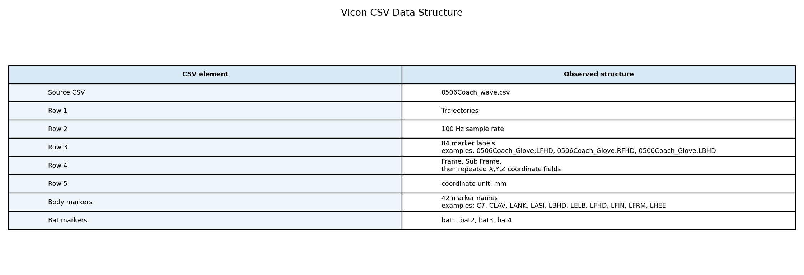
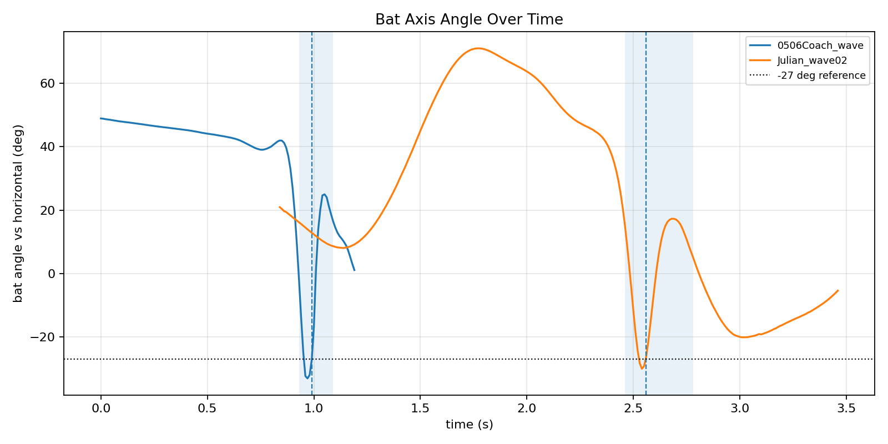
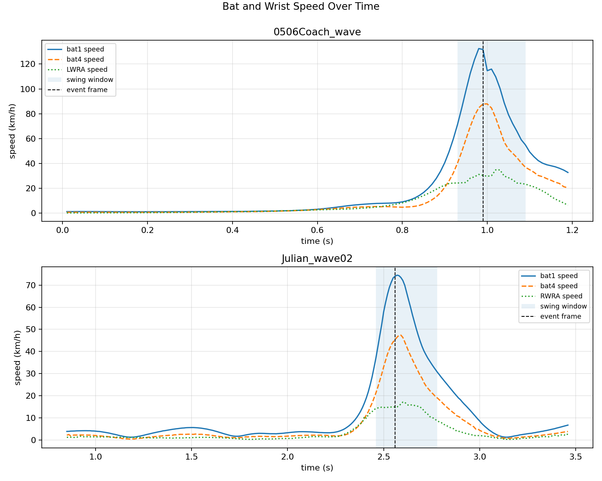

# Vicon Swing Metrics

Input: `../Vicon_Wave_250506(1)` Vicon trajectory CSV files.

Assumptions: coordinates are in millimeters; sample rate comes from row 2 (`100 Hz`); `Z` is vertical; the bat axis is `bat4 -> bat1`. Bat angle is `atan2(delta_Z, horizontal_distance)` in degrees.

Swing event is selected as the frame where the bat-axis angle is closest to `-27 deg`, matching the provided reference. Swing duration is the contiguous high-speed window around that event where `bat4` speed remains above `40%` of its trial peak. This threshold gives the Coach reference trial a `0.16 s` window.

## CSV Structure

- Row 1 identifies the Vicon section as `Trajectories`.
- Row 2 contains the sample rate, `100 Hz` for both files.
- Row 3 contains marker names. Each marker then has three coordinate columns.
- Row 4 contains `Frame`, `Sub Frame`, then repeated `X,Y,Z` coordinate fields.
- Row 5 states coordinate units as `mm`.
- Timestamps are reconstructed as `(Frame - 1) / sample_rate_hz`.
- Body markers include head (`LFHD/RFHD/LBHD/RBHD`), shoulders, elbows, wrists, pelvis (`LASI/RASI/LPSI/RPSI`), knees, ankles, heels, toes, and finger markers.
- Bat markers are `bat1`, `bat2`, `bat3`, `bat4`; the longest and most stable axis is `bat1-bat4` at about `293 mm`.

## 1. Metric Feasibility vs Vicon Raw Data

Status meanings: `direct` is a direct 3D marker geometry calculation; `raw_only` means the physical value exists but SlyMask's percentile/rating needs a reference population; `proxy` means the value is computable but the app's exact event or target definition is missing; `direct_batting_context` means the geometry is direct, but SlyMask describes the metric for pitching while these Vicon files are batting swings.

The SlyMask categorical labels (`Good`, `Attention`, `Deviate`) and reliability percentages are not reproduced here because they require proprietary thresholds, a reference population, and the app's internal confidence model. This report focuses on whether the underlying physical metric can be extracted automatically from the Vicon CSV.

| trial | family | metric | value | unit | status | Vicon raw data | calculation / reason |
|---|---|---|---:|---|---|---|---|
| 0506Coach_wave | Swing Analysis | Estimated Bat Speed | 131.717 | km/h | direct | `bat1/bat4` 3D coordinates, frame timestamps | 3D speed of bat1 at selected swing event; bat4 is also reported in the summary because barrel marker identity is ambiguous. |
| 0506Coach_wave | Swing Analysis | Swing Speed | 131.717 | km/h | raw_only | `bat1/bat4` 3D coordinates, frame timestamps | Raw bat endpoint speed is available; SlyMask-style percentile needs a reference population. |
| 0506Coach_wave | Swing Analysis | Hip Rotation | 34.523 | deg | direct | `LASI/RASI/LPSI/RPSI` pelvis markers | Pelvis yaw range over the selected high-speed swing window. |
| 0506Coach_wave | Swing Analysis | Hip-Shoulder Sep | 36.178 | deg | direct | `LASI/RASI/LPSI/RPSI`, `LSHO/RSHO` | Absolute yaw difference between pelvis axis and shoulder axis at the event frame. |
| 0506Coach_wave | Swing Analysis | Weight Transfer | 1.475 | % | proxy | `LASI/RASI/LPSI/RPSI`, `LANK/RANK` | Pelvis midpoint translation from phase start to event, normalized by ankle stance width; not a full COM model. |
| 0506Coach_wave | Swing Analysis | Lead Knee Angle | 136.435 | deg | direct | `LASI/LKNE/LANK` | Left lead-knee angle from LASI-LKNE-LANK. |
| 0506Coach_wave | Swing Analysis | Trunk Tilt | 24.262 | deg | direct | `LSHO/RSHO`, `LASI/RASI/LPSI/RPSI`, vertical `Z` | Torso midpoint vector relative to vertical Z axis. |
| 0506Coach_wave | Swing Analysis | Contact Time |  | ms | unavailable | Missing ball marker or bat-ball contact label | No ball-contact label, bat-ball impact event, or ball marker exists in this CSV. |
| 0506Coach_wave | Swing Analysis | Attack Angle | -27.105 | deg | proxy | `bat1/bat4` 3D coordinates | Bat axis angle relative to the horizontal plane at selected event; true attack angle needs a contact-frame definition. |
| 0506Coach_wave | Swing Analysis | Head Stability | 49.174 | % | proxy | `LFHD/RFHD/LBHD/RBHD`, pelvis markers | Head midpoint drift relative to pelvis midpoint over the selected swing window. |
| 0506Coach_wave | Motion Metrics | Elbow Bend | 138.147 | deg | direct_batting_context | `RSHO/RELB/RWRA` | Right elbow angle from RSHO-RELB-RWRA; SlyMask's pitching acceleration interpretation is not directly applicable to this batting dataset. |
| 0506Coach_wave | Motion Metrics | Arm Abduction | 105.572 | deg | direct_batting_context | `RSHO/RELB`, shoulder midpoint, pelvis midpoint | Right upper-arm angle relative to torso axis; pitching arm-slot interpretation is not directly applicable. |
| 0506Coach_wave | Motion Metrics | Trunk Lean | 24.262 | deg | direct_batting_context | `LSHO/RSHO`, pelvis markers, vertical `Z` | Same torso-vs-vertical geometry as Trunk Tilt, measured at swing event instead of pitching release. |
| 0506Coach_wave | Motion Metrics | Stride Angle | 57.488 | deg | proxy | `LANK/RANK`, pelvis axis markers | Planar angle between ankle stance line and pelvis axis at event; pitching front-foot-landing definition is unavailable. |
| 0506Coach_wave | Motion Metrics | Lead Knee | 136.435 | deg | direct_batting_context | `LASI/LKNE/LANK` | Left lead-knee angle from LASI-LKNE-LANK; measured at swing event. |
| 0506Coach_wave | Motion Metrics | Hip-Shoulder Sep | 36.178 | deg | direct_batting_context | `LASI/RASI/LPSI/RPSI`, `LSHO/RSHO` | Same pelvis-shoulder yaw separation as batting metric, measured at swing event. |
| 0506Coach_wave | Motion Metrics | Arm Speed | 30.425 | km/h | raw_only | `LWRA/LWRB/RWRA/RWRB` 3D coordinates, frame timestamps | Fastest wrist marker at event is LWRA; percentile needs a reference population. |
| 0506Coach_wave | Motion Metrics | Stride Length | 0.620 | body heights | proxy | `LANK/RANK`, head and foot height proxy markers | Ankle stance distance divided by head-to-foot height proxy; pitching stride event definition is unavailable. |
| 0506Coach_wave | Motion Metrics | Weight Transfer | 1.475 | % | proxy | `LASI/RASI/LPSI/RPSI`, `LANK/RANK` | Same pelvis-shift proxy as batting Weight Transfer; not a validated COM transfer metric. |
| 0506Coach_wave | Motion Metrics | Head Stability | 49.174 | % | proxy | `LFHD/RFHD/LBHD/RBHD`, pelvis markers | Head drift relative to pelvis over the swing window; SlyMask stride-line definition is unavailable. |
| 0506Coach_wave | Motion Metrics | Foot Direction | 79.280 | deg | proxy | `LTOE/LHEE`, `LANK/RANK` | Left heel-to-toe direction relative to stance line at event; home-plate target direction is unavailable. |
| 0506Coach_wave | Motion Metrics | Wrist Snap | 57.287 | deg | proxy | `LELB/RELB`, wrist pair, `LFIN/RFIN` | Change in elbow-wrist-finger angle from phase start to event using the fastest hand side. |
| 0506Coach_wave | Motion Metrics | Fingertip Speed | 39.432 | km/h | raw_only | `LFIN/RFIN` 3D coordinates, frame timestamps | Fastest hand/finger marker at event is LFIN; percentile needs a reference population. |
| Julian_wave02 | Swing Analysis | Estimated Bat Speed | 74.019 | km/h | direct | `bat1/bat4` 3D coordinates, frame timestamps | 3D speed of bat1 at selected swing event; bat4 is also reported in the summary because barrel marker identity is ambiguous. |
| Julian_wave02 | Swing Analysis | Swing Speed | 74.019 | km/h | raw_only | `bat1/bat4` 3D coordinates, frame timestamps | Raw bat endpoint speed is available; SlyMask-style percentile needs a reference population. |
| Julian_wave02 | Swing Analysis | Hip Rotation | 99.432 | deg | direct | `LASI/RASI/LPSI/RPSI` pelvis markers | Pelvis yaw range over the selected high-speed swing window. |
| Julian_wave02 | Swing Analysis | Hip-Shoulder Sep | 9.657 | deg | direct | `LASI/RASI/LPSI/RPSI`, `LSHO/RSHO` | Absolute yaw difference between pelvis axis and shoulder axis at the event frame. |
| Julian_wave02 | Swing Analysis | Weight Transfer | 3.851 | % | proxy | `LASI/RASI/LPSI/RPSI`, `LANK/RANK` | Pelvis midpoint translation from phase start to event, normalized by ankle stance width; not a full COM model. |
| Julian_wave02 | Swing Analysis | Lead Knee Angle | 164.733 | deg | direct | `LASI/LKNE/LANK` | Left lead-knee angle from LASI-LKNE-LANK. |
| Julian_wave02 | Swing Analysis | Trunk Tilt | 41.206 | deg | direct | `LSHO/RSHO`, `LASI/RASI/LPSI/RPSI`, vertical `Z` | Torso midpoint vector relative to vertical Z axis. |
| Julian_wave02 | Swing Analysis | Contact Time |  | ms | unavailable | Missing ball marker or bat-ball contact label | No ball-contact label, bat-ball impact event, or ball marker exists in this CSV. |
| Julian_wave02 | Swing Analysis | Attack Angle | -26.255 | deg | proxy | `bat1/bat4` 3D coordinates | Bat axis angle relative to the horizontal plane at selected event; true attack angle needs a contact-frame definition. |
| Julian_wave02 | Swing Analysis | Head Stability | 48.623 | % | proxy | `LFHD/RFHD/LBHD/RBHD`, pelvis markers | Head midpoint drift relative to pelvis midpoint over the selected swing window. |
| Julian_wave02 | Motion Metrics | Elbow Bend | 135.717 | deg | direct_batting_context | `RSHO/RELB/RWRA` | Right elbow angle from RSHO-RELB-RWRA; SlyMask's pitching acceleration interpretation is not directly applicable to this batting dataset. |
| Julian_wave02 | Motion Metrics | Arm Abduction | 122.050 | deg | direct_batting_context | `RSHO/RELB`, shoulder midpoint, pelvis midpoint | Right upper-arm angle relative to torso axis; pitching arm-slot interpretation is not directly applicable. |
| Julian_wave02 | Motion Metrics | Trunk Lean | 41.206 | deg | direct_batting_context | `LSHO/RSHO`, pelvis markers, vertical `Z` | Same torso-vs-vertical geometry as Trunk Tilt, measured at swing event instead of pitching release. |
| Julian_wave02 | Motion Metrics | Stride Angle | 14.478 | deg | proxy | `LANK/RANK`, pelvis axis markers | Planar angle between ankle stance line and pelvis axis at event; pitching front-foot-landing definition is unavailable. |
| Julian_wave02 | Motion Metrics | Lead Knee | 164.733 | deg | direct_batting_context | `LASI/LKNE/LANK` | Left lead-knee angle from LASI-LKNE-LANK; measured at swing event. |
| Julian_wave02 | Motion Metrics | Hip-Shoulder Sep | 9.657 | deg | direct_batting_context | `LASI/RASI/LPSI/RPSI`, `LSHO/RSHO` | Same pelvis-shoulder yaw separation as batting metric, measured at swing event. |
| Julian_wave02 | Motion Metrics | Arm Speed | 15.011 | km/h | raw_only | `LWRA/LWRB/RWRA/RWRB` 3D coordinates, frame timestamps | Fastest wrist marker at event is RWRA; percentile needs a reference population. |
| Julian_wave02 | Motion Metrics | Stride Length | 0.611 | body heights | proxy | `LANK/RANK`, head and foot height proxy markers | Ankle stance distance divided by head-to-foot height proxy; pitching stride event definition is unavailable. |
| Julian_wave02 | Motion Metrics | Weight Transfer | 3.851 | % | proxy | `LASI/RASI/LPSI/RPSI`, `LANK/RANK` | Same pelvis-shift proxy as batting Weight Transfer; not a validated COM transfer metric. |
| Julian_wave02 | Motion Metrics | Head Stability | 48.623 | % | proxy | `LFHD/RFHD/LBHD/RBHD`, pelvis markers | Head drift relative to pelvis over the swing window; SlyMask stride-line definition is unavailable. |
| Julian_wave02 | Motion Metrics | Foot Direction | 78.326 | deg | proxy | `LTOE/LHEE`, `LANK/RANK` | Left heel-to-toe direction relative to stance line at event; home-plate target direction is unavailable. |
| Julian_wave02 | Motion Metrics | Wrist Snap | 47.194 | deg | proxy | `LELB/RELB`, wrist pair, `LFIN/RFIN` | Change in elbow-wrist-finger angle from phase start to event using the fastest hand side. |
| Julian_wave02 | Motion Metrics | Fingertip Speed | 18.954 | km/h | raw_only | `LFIN/RFIN` 3D coordinates, frame timestamps | Fastest hand/finger marker at event is RFIN; percentile needs a reference population. |

General formulas used in the table: joint angles use the vector dot product at the middle marker, `acos((BA dot BC) / (||BA|| ||BC||))`; marker speeds use 3D position differencing over adjacent frames; pelvis/shoulder rotations use planar yaw from left-right marker axes; normalization metrics use available body marker distances because the CSV has no explicit whole-body COM model.

## Coverage Summary

| trial | total SlyMask rows | direct geometry | raw value only | proxy | unavailable |
|---|---:|---:|---:|---:|---:|
| 0506Coach_wave | 23 | 10 | 3 | 9 | 1 |
| Julian_wave02 | 23 | 10 | 3 | 9 | 1 |

Interpretation: Vicon covers the body-geometry metrics well because it has calibrated 3D body markers, wrist/finger markers, timestamps, and explicit bat markers. It does not provide SlyMask's population percentiles, categorical labels, or reliability scores.

Main limitations:

- `Contact Time` remains unavailable: the CSV has no ball marker, no bat-ball impact label, and no contact interval annotation.
- `Swing Speed`, `Arm Speed`, and `Fingertip Speed` can be output as raw physical speeds, but SlyMask-style percentiles need a reference population.
- `Weight Transfer` is only a pelvis-shift proxy here because the CSV does not define a full-body COM model or force/pressure transfer.
- `Attack Angle` is a bat-axis angle at the selected event; true attack angle still depends on a contact-frame definition.
- Pitching-specific interpretations such as arm slot, stride landing, and release are geometrically computable in this batting Vicon dataset, but their SlyMask pitching semantics are not directly applicable.

## 2. Specific Parameter Output and Validation

Bat-head angle is computed from the selected bat axis `bat4 -> bat1`: `angle = atan2(Z_bat1 - Z_bat4, sqrt((X_bat1 - X_bat4)^2 + (Y_bat1 - Y_bat4)^2))`. The event frame is the frame whose bat-axis angle is closest to the provided `-27 deg` reference.

Speed is computed by frame-to-frame 3D finite difference: `speed_km_h = ||P_t - P_(t-1)|| / delta_t * 0.0036`, where coordinates are in millimeters and `delta_t = 0.01 s` at `100 Hz`.

Swing time is defined as the contiguous high-speed window around the event frame where `bat4` speed remains above `40%` of that trial's peak `bat4` speed. This operational definition is automatic and gives the Coach reference trial a `0.16 s` window.

| trial | event time (s) | bat angle (deg) | bat1 speed (km/h) | bat4 speed (km/h) | best wrist marker | wrist speed (km/h) | best hand marker | hand speed (km/h) | swing start-end (s) | swing time (s) |
|---|---:|---:|---:|---:|---|---:|---|---:|---:|---:|
| 0506Coach_wave | 0.990 | -27.1 | 131.7 | 87.9 | LWRA | 30.4 | LFIN | 39.4 | 0.930-1.090 | 0.160 |
| Julian_wave02 | 2.560 | -26.3 | 74.0 | 45.3 | RWRA | 15.0 | RFIN | 19.0 | 2.460-2.780 | 0.320 |

Reference comparison: `0506Coach_wave` matches the requested bat angle (`-27.1 deg`). Its fastest endpoint `bat1` is `131.7 km/h`; the opposite endpoint `bat4` is `87.9 km/h`, closer to the requested `95 km/h`. The best wrist marker at the same frame is `LWRA = 30.4 km/h`; the best hand/finger marker is `LFIN = 39.4 km/h`, matching the requested wrist/hand-speed reference better if the reference used a hand/finger marker rather than a strict wrist marker.

## 4. Visualizations

## Body Metrics at Event

| trial | hip rotation (deg) | hip-shoulder sep (deg) | lead knee (deg) | trunk tilt (deg) | head stability (%) |
|---|---:|---:|---:|---:|---:|
| 0506Coach_wave | 34.523 | 36.178 | 136.435 | 24.262 | 49.174 |
| Julian_wave02 | 99.432 | 9.657 | 164.733 | 41.206 | 48.623 |
